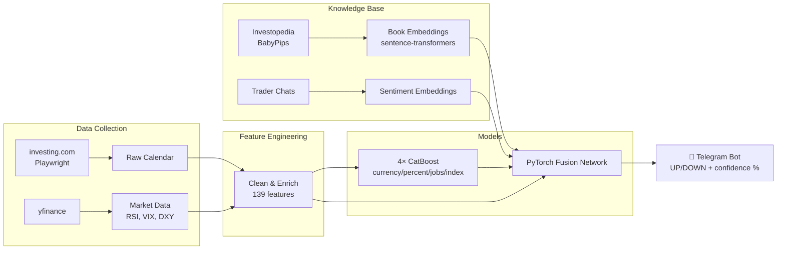

# News Predictor AI — Hybrid ML System for Financial Event Prediction

> **Problem:** Трейдеры и аналитики реагируют на экономические новости (CPI, NFP, GDP) интуитивно, без систематического анализа исторических паттернов. Ручной анализ влияния макроэкономических событий на валютные пары (EUR, USD, RUB) занимает часы.
>
> **Solution:** Гибридная ML-система, объединяющая 3 источника сигналов: табличные данные (139 фичей), knowledge base из Investopedia/BabyPips (embeddings), и анализ трейдерского сентимента — через PyTorch Fusion Network + 4 специализированных CatBoost-модели.
>
> **Outcome:** 54.16% overall accuracy на 7865 исторических событиях (baseline 50% на эффективном рынке). При confidence >65% — 85.7% accuracy. Telegram-бот выдаёт прогноз за секунды.

### Key Metrics
| Metric | Value |
|---|---|
| Обучающая выборка | 7 865 экономических событий |
| Валюты | EUR, USD, RUB |
| Табличных фичей | 139 (RSI, VIX, DXY, delta прогнозов) |
| CatBoost-моделей | 4 (currency, percent, jobs, index) |
| Overall accuracy | 54.16% (random baseline = 50%) |
| High-confidence accuracy (>65%) | 85.7% |
| ML-приёмы | LayerNorm, AdamW, Cosine Annealing, gradient clipping, time-based split |

### Pipeline Architecture



### Tech Stack


### Demo
🎬 [Видео-демо работы бота](#)

---

## 🚀 Как запустить (Quick Start)

Этот проект настроен для запуска "как есть" (as is). Вам нужен только Python 3.10+.

### 1. Установка зависимостей
```bash
pip install -r requirements.txt
python3 -m playwright install chromium
```

### 2. Запуск бота
```bash
# Нужно задать токен вашего бота (получить у @BotFather)
# Скопируйте .env.example в .env и укажите токен:
cp .env.example .env

# Запуск
python3 bot/telegram_bot.py
```

---

## 📂 Структура проекта

```
pipeline/
  01_collect_data.py      # Сбор данных с investing.com (Playwright)
  02_clean_data.py        # Очистка и нормализация
  03_enrich_data.py       # Обогащение рыночными данными (yfinance: RSI, VIX, DXY)
  04_train_catboost.py    # Обучение 4× CatBoost-моделей
  05_test_model.py        # Тестирование моделей
  06_prepare_books.py     # Парсинг Investopedia/BabyPips в knowledge base
  06b_trader_sentiment.py # Анализ трейдерского сентимента
  07_create_embeddings.py # Генерация embeddings (sentence-transformers)
  08_train_fusion.py      # Обучение PyTorch Fusion Network
  09_final_prediction.py  # Финальный прогноз
bot/
  telegram_bot.py         # Telegram-бот (Fusion Network + CatBoost)
  predict_bot.py          # Бот на базовом CatBoost
docs/
  theory.py               # Теоретические основы ML-пайплайна
data/                     # Датасеты
models/                   # Обученные модели CatBoost
```

---

## 🤖 Как пользоваться ботом

Отправьте боту данные в таком формате:

```text
Валюта-USD
Событие-CPI (м/м)
Важн.-3 звезды
Прогноз-0,4%
Пред.-0,6%
```

Бот проанализирует историю, применит правила и выдаст прогноз (ВЫШЕ/НИЖЕ) с уверенностью в %.

---

## 🛠 Требования
*   Python 3.10+
*   RAM: 4GB+ (для загрузки embeddings)
*   GPU: не обязательно (работает на CPU)
